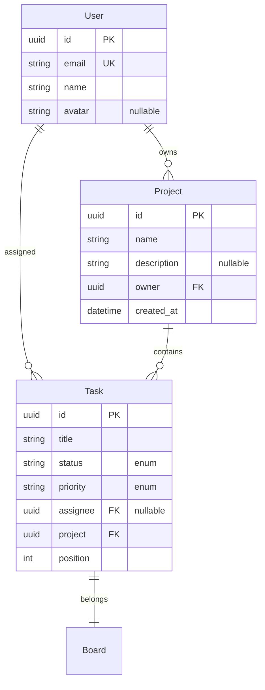

# Exporting Blueprints

Exporting is how you turn your PRDL blueprint into real, usable artifacts. PRDKit supports multiple export formats targeting different layers of your stack — from API specifications to database schemas to frontend types.

## Export Command

### Basic Usage

```bash
# Export a single format
npx prdkit export blueprints/app.prdl --format openapi

# Export multiple formats
npx prdkit export blueprints/app.prdl --format openapi,prisma,typescript

# Export all available formats
npx prdkit export blueprints/app.prdl --all
```

### Output Directory

By default, exports go to `exports/` relative to your project root. Override with:

```bash
npx prdkit export blueprints/app.prdl --all --output ./generated
```

### Watch Mode

Automatically re-export when the blueprint changes:

```bash
npx prdkit export blueprints/app.prdl --all --watch
```

---

## Format: Markdown (Full PRD Documentation)

Generates comprehensive human-readable product requirements documentation.

```bash
npx prdkit export blueprints/app.prdl --format markdown
```

**Output:**

- `exports/<name>.prd.md` — Full PRD document with:
  - Product overview and domain context
  - Actor definitions with all fields and types
  - Relationship diagrams (ASCII art)
  - Endpoint documentation with request/response examples
  - Auth and security specifications
  - Data flow descriptions

**Configuration:**

```json
{
  "exports": {
    "markdown": {
      "includeDiagrams": true,
      "includeExamples": true,
      "toc": true,
      "template": "custom-markdown.hbs"
    }
  }
}
```

**Example excerpt:**

```markdown
# TaskFlow — Product Requirements Document

## Actors

### User
| Field     | Type   | Constraints          |
|-----------|--------|----------------------|
| id        | UUID   | primary              |
| email     | Email  | unique, required     |
| name      | String | required             |
| avatar    | URL    | optional             |

### Task
| Field       | Type                      | Constraints      |
|-------------|---------------------------|------------------|
| id          | UUID                      | primary          |
| title       | String                    | required         |
| status      | Enum                      | backlog,todo,... |
| priority    | Enum                      | low,medium,...   |

## API Endpoints

### POST /auth/register
- **Auth:** public
- **Request Body:** { email, name, password }
- **Response:** User
```

---

## Format: OpenAPI

Generates an [OpenAPI 3.1](https://spec.openapis.org/oas/latest.html) specification.

```bash
npx prdkit export blueprints/app.prdl --format openapi
```

**Output:** `exports/openapi.yaml`

**Features:**

- All endpoints mapped to OpenAPI paths
- Request/response schemas derived from actor fields
- Authentication schemes (JWT, OAuth2, API Key)
- Enum values, nullable fields, array types
- Example values for all schemas

**Configuration:**

```json
{
  "exports": {
    "openapi": {
      "version": "3.1.0",
      "includeExamples": true,
      "customTags": ["TaskFlow API"],
      "servers": [
        { "url": "https://api.example.com", "description": "Production" },
        { "url": "https://staging.example.com", "description": "Staging" }
      ]
    }
  }
}
```

---

## Format: Prisma Schema

Generates a [Prisma](https://www.prisma.io/) schema file for database modeling.

```bash
npx prdkit export blueprints/app.prdl --format prisma
```

**Output:** `exports/schema.prisma`

**Features:**

- Models mapped from PRDL actors
- Fields with proper Prisma types (String, Int, DateTime, etc.)
- `@id`, `@unique`, `@default`, `@relation` annotations
- Enums from PRDL enum types
- Relations (`has_many`, `belongs_to`) mapped to Prisma relations
- Provider configuration (PostgreSQL, MySQL, SQLite)

**Configuration:**

```json
{
  "exports": {
    "prisma": {
      "provider": "postgresql",
      "generateClient": true,
      "addTimestamps": true,
      "relationMode": "prisma"
    }
  }
}
```

**Example excerpt:**

```prisma
generator client {
  provider = "prisma-client-js"
}

datasource db {
  provider = "postgresql"
  url      = env("DATABASE_URL")
}

enum TaskStatus {
  backlog
  todo
  in_progress
  review
  done
}

model User {
  id        String   @id @default(uuid())
  email     String   @unique
  name      String
  avatar    String?
  createdAt DateTime @default(now())
  tasks     Task[]
}

model Task {
  id        String     @id @default(uuid())
  title     String
  status    TaskStatus @default(backlog)
  priority  Priority   @default(medium)
  assignee  String?
  projectId String
  project   Project    @relation(fields: [projectId], references: [id])
  user      User?      @relation(fields: [assignee], references: [id])
}
```

---

## Format: Zod Schemas

Generates [Zod](https://zod.dev/) validation schemas for runtime type checking in TypeScript.

```bash
npx prdkit export blueprints/app.prdl --format zod
```

**Output:** `exports/schemas.zod.ts`

**Features:**

- Input validation schemas for all API endpoints
- Type inference exports (`z.infer<typeof Schema>`)
- Custom error messages
- Refinements for business rules (e.g., `email().min(5)`)

**Example excerpt:**

```typescript
import { z } from 'zod';

export const UserSchema = z.object({
  id: z.string().uuid(),
  email: z.string().email(),
  name: z.string().min(1).max(100),
  avatar: z.string().url().optional(),
});

export const CreateTaskSchema = z.object({
  title: z.string().min(1).max(200),
  description: z.string().optional(),
  status: z.enum(['backlog', 'todo', 'in_progress', 'review', 'done']).default('backlog'),
  priority: z.enum(['low', 'medium', 'high', 'critical']).default('medium'),
  dueDate: z.string().date().optional(),
  projectId: z.string().uuid(),
});

export type User = z.infer<typeof UserSchema>;
export type CreateTask = z.infer<typeof CreateTaskSchema>;
```

---

## Format: TypeScript Types

Generates TypeScript type definitions and interfaces.

```bash
npx prdkit export blueprints/app.prdl --format typescript
```

**Output:** `exports/types.ts`

**Features:**

- Interfaces for all actors and their fields
- Request/response types for all endpoints
- Utility types (Pagination, ApiResponse, etc.)
- Strict null handling
- JSDoc comments from PRDL descriptions

**Configuration:**

```json
{
  "exports": {
    "typescript": {
      "strict": true,
      "nullSafety": "exact",
      "includeResponses": true,
      "barrelExport": true
    }
  }
}
```

**Example excerpt:**

```typescript
/** Represents a user in the system */
export interface User {
  id: string;
  email: string;
  name: string;
  avatar: string | null;
  createdAt: string;
}

export interface Task {
  id: string;
  title: string;
  description: string | null;
  status: 'backlog' | 'todo' | 'in_progress' | 'review' | 'done';
  priority: 'low' | 'medium' | 'high' | 'critical';
  labels: string[];
  dueDate: string | null;
  assignee: string | null;
  projectId: string;
  position: number;
}

/** POST /auth/register — Request body */
export interface RegisterRequest {
  email: string;
  name: string;
  password: string;
}

/** POST /auth/register — Response body */
export interface RegisterResponse extends User {}
```

---

## Format: Python Models

Generates Python [Pydantic](https://docs.pydantic.dev/) models.

```bash
npx prdkit export blueprints/app.prdl --format python
```

**Output:** `exports/models.py`

**Features:**

- Pydantic BaseModel classes for all actors
- Field validators for email, URL, UUID
- Enums from PRDL enum types
- Optional fields handled with `Optional[]`
- Type hints throughout

**Example excerpt:**

```python
from pydantic import BaseModel, EmailStr, Field
from typing import Optional
from enum import Enum
from uuid import UUID

class TaskStatus(str, Enum):
    backlog = "backlog"
    todo = "todo"
    in_progress = "in_progress"
    review = "review"
    done = "done"

class User(BaseModel):
    id: UUID
    email: EmailStr
    name: str = Field(..., min_length=1, max_length=100)
    avatar: Optional[str] = None

class Task(BaseModel):
    id: UUID
    title: str = Field(..., min_length=1, max_length=200)
    description: Optional[str] = None
    status: TaskStatus = TaskStatus.backlog
    priority: Priority = Priority.medium
    assignee: Optional[UUID] = None
    project_id: UUID
```

---

## Format: Docker Compose

Generates a `docker-compose.yml` file for the full application stack.

```bash
npx prdkit export blueprints/app.prdl --format docker
```

**Output:** `exports/docker-compose.yml`

**Features:**

- API service with your specified runtime (Node.js, Python, Go)
- Database service (PostgreSQL, MySQL, MongoDB)
- Cache service (Redis) if your blueprint has caching
- Environment variable injection
- Volume mounts for persistence
- Health checks on all services

**Configuration:**

```json
{
  "exports": {
    "docker": {
      "apiRuntime": "node:20-alpine",
      "database": "postgres:16-alpine",
      "cache": "redis:7-alpine",
      "port": 3000,
      "includeHealthchecks": true
    }
  }
}
```

**Example excerpt:**

```yaml
version: "3.8"

services:
  api:
    build:
      context: .
      dockerfile: Dockerfile
    ports:
      - "3000:3000"
    environment:
      - DATABASE_URL=postgresql://prdkit:prdkit@db:5432/prdkit
      - REDIS_URL=redis://cache:6379
    depends_on:
      db:
        condition: service_healthy
      cache:
        condition: service_started
    healthcheck:
      test: ["CMD", "wget", "--no-verbose", "--tries=1", "http://localhost:3000/health"]
      interval: 30s
      timeout: 10s
      retries: 3

  db:
    image: postgres:16-alpine
    environment:
      POSTGRES_USER: prdkit
      POSTGRES_PASSWORD: prdkit
      POSTGRES_DB: prdkit
    volumes:
      - pgdata:/var/lib/postgresql/data
    healthcheck:
      test: ["CMD-SHELL", "pg_isready -U prdkit"]
      interval: 5s
      timeout: 5s
      retries: 5

  cache:
    image: redis:7-alpine
    ports:
      - "6379:6379"
    volumes:
      - redisdata:/data

volumes:
  pgdata:
  redisdata:
```

---

## Format: Design Tokens

Generates design tokens for consistent UI development.

```bash
npx prdkit export blueprints/app.prdl --format tokens
```

**Output:** `exports/tokens.json`

**Features:**

- Color palette generation from brand description
- Typography scale
- Spacing grid
- Border radii and shadow definitions
- Breakpoint definitions
- Also exports CSS custom properties in `exports/tokens.css`

**Configuration:**

```json
{
  "exports": {
    "tokens": {
      "colorMode": "light",
      "spacingUnit": 4,
      "baseFontSize": 16,
      "borderRadius": "4px"
    }
  }
}
```

**Example excerpt:**

```json
{
  "colors": {
    "primary": "#6366F1",
    "primaryLight": "#A5B4FC",
    "primaryDark": "#4338CA",
    "secondary": "#10B981",
    "background": "#FFFFFF",
    "surface": "#F9FAFB",
    "text": "#111827",
    "textSecondary": "#6B7280",
    "error": "#EF4444",
    "warning": "#F59E0B",
    "success": "#10B981"
  },
  "typography": {
    "fontFamily": "'Inter', -apple-system, sans-serif",
    "fontMono": "'JetBrains Mono', monospace",
    "fontSizes": {
      "xs": "0.75rem",
      "sm": "0.875rem",
      "base": "1rem",
      "lg": "1.125rem",
      "xl": "1.25rem",
      "2xl": "1.5rem",
      "3xl": "1.875rem",
      "4xl": "2.25rem"
    }
  },
  "spacing": {
    "xs": "0.25rem",
    "sm": "0.5rem",
    "md": "1rem",
    "lg": "1.5rem",
    "xl": "2rem",
    "2xl": "3rem",
    "3xl": "4rem"
  }
}
```

---

## Format: Mermaid Diagrams

Generates [Mermaid](https://mermaid.js.org/) diagram definitions for visual documentation.

```bash
npx prdkit export blueprints/app.prdl --format mermaid
```

**Output:**

- `exports/diagrams/entity-relationship.mmd` — ERD between all actors
- `exports/diagrams/data-flow.mmd` — Data flow between endpoints and actors
- `exports/diagrams/state-machine.mmd` — State transitions for stateful actors

**Features:**

- Entity relationship diagrams showing actors, fields, and relationships
- Data flow diagrams showing API routes and data movement
- State machine diagrams for entities with lifecycle states
- Renders inline in GitHub/GitLab flavored Markdown

**Example (entity-relationship.mmd):**



**Configuration:**

```json
{
  "exports": {
    "mermaid": {
      "includeEntityRelationship": true,
      "includeDataFlow": true,
      "includeStateMachine": true,
      "theme": "default"
    }
  }
}
```

---

## Export All Formats

The quickest way to generate everything:

```bash
npx prdkit export blueprints/app.prdl --all
```

This creates the following directory structure:

```
exports/
  ├── app.prd.md                    # Full PRD documentation
  ├── openapi.yaml                  # OpenAPI 3.1 spec
  ├── schema.prisma                 # Prisma schema
  ├── schemas.zod.ts                # Zod validation schemas
  ├── types.ts                      # TypeScript types
  ├── models.py                     # Python Pydantic models
  ├── docker-compose.yml            # Docker Compose stack
  ├── tokens.json                   # Design tokens (JSON)
  ├── tokens.css                    # Design tokens (CSS vars)
  └── diagrams/
      ├── entity-relationship.mmd   # ERD diagram
      ├── data-flow.mmd             # Data flow diagram
      └── state-machine.mmd         # State machine diagram
```

## Configuration Reference

Full export configuration in `prdkit.config.json`:

```json
{
  "exports": {
    "outputDir": "exports",
    "formats": ["openapi", "prisma", "typescript", "zod", "python", "markdown"],
    "markdown": {
      "enabled": true,
      "includeDiagrams": true
    },
    "openapi": {
      "enabled": true,
      "version": "3.1.0"
    },
    "prisma": {
      "enabled": true,
      "provider": "postgresql"
    },
    "zod": {
      "enabled": true
    },
    "typescript": {
      "enabled": true,
      "strict": true
    },
    "python": {
      "enabled": true,
      "usePydanticV2": true
    },
    "docker": {
      "enabled": false
    },
    "tokens": {
      "enabled": false
    },
    "mermaid": {
      "enabled": true
    }
  }
}
```

Use `npx prdkit export --help` to see all available flags and options.
